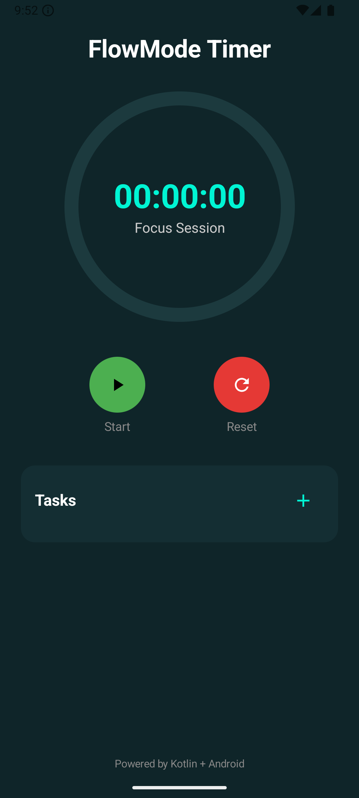

<div align="center">

  # Stopwatch with Productivity Timer

</div>

---

<div align="center">
  
</div>


---

<br>

<details>
<summary>German</summary>

## 📖 Über das Projekt

Dieses Projekt hat zwei Entwicklungsphasen durchlaufen:

### Phase 1: Der erste Entwurf (Hyperskill)

Ursprünglich ist diese App als Projekt der Lernplattform **Hyperskill** entstanden. In dieser ersten Phase ging es mir primär darum, die von Hyperskill vorgegebenen funktionalen Anforderungen präzise umzusetzen und das Projekt erfolgreich abzuschließen.
* **Technisches Fundament:** Klassisches Android-Entwicklungsmuster mit XML-Layouts (`activity_main.xml`), `Handler` & `Runnable` für die Zeitzählung sowie Android Notifications.
* **Fokus:** Eine solide, funktionsfähige Stoppuhr mit Limit-Einstellung und Benachrichtigung.

### Phase 2: Modernisierung & Feature-Erweiterung (mit KI-Unterstützung)
Nachdem das Grundgerüst stand, wollte ich mich nicht damit zufriedengeben und habe die App grundlegend überarbeitet und zu einem echten Produktivitäts-Tool ausgebaut:
* **UI Redesign mit Jetpack Compose:** Kompletter Umstieg von XML auf ein modernes, deklaratives UI mit Custom Canvas-Zeichnungen (`CircularProgressRing`) und dunklem Produktivitäts-Design.
* **Architektur & State Management:** Umstellung auf **MVVM** (`MainViewModel`), zwei Singleton-Repositories (`TimerRepository`, `TaskRepository`) und `StateFlow` für eine saubere Trennung von Logik und UI.
* **Hintergrundbetrieb & Alarm:** Integration eines `TimerService` (Foreground Service), damit der Timer zuverlässig weiterläuft, inklusive Steuerung über die System-Benachrichtigung und Sound-Signal via `RingtoneManager`.
* **KI-Unterstützung:** Während die funktionale Erstversion strikt den Hyperskill-Vorgaben folgte, wurde der zweite Entwurf mit Unterstützung von KI realisiert. Durch gezielte Fragen, Iterationen und Architektur-Diskussionen zum UI-Design, Jetpack Compose und Service-Management konnte ich das Projekt effizient auf ein professionelles Niveau heben.

---

## ✨ Features im Überblick

| Feature | Hyperskill Version <br> (`finished-as-per-hyperskill`) | Modern FlowMode Version <br> (`finished-with-new-ui-and-features`) |
| :--- | :---: | :---: |
| **UI-Technologie** | Klassisches XML (`View`-System) | Jetpack Compose (Material 3) |
| **Architektur** | Activity-basiert | MVVM + StateFlow + Repositories |
| **Zeitmessung** | `Handler` / `Runnable` | Coroutines + SystemClock |
| **Visualisierung** | Standard-Progressbar (Zufallsfarben) | `CircularProgressRing` (Canvas) |
| **Task-Management** | ❌ Nicht vorhanden | ✅ Aufgabenerstellung, Timer-Kopplung, Abhaken, Löschen |
| **Hintergrunddienst** | ❌ Einfache Notification | ✅ Foreground Service (`TimerService`) |
| **Audio-Alarm** | ❌ Nicht vorhanden | ✅ Sound-Wiedergabe via `RingtoneManager` bei Zielerreichung |

---

## 🎬 Vorher & Nachher (Demonstration)

Hier kannst du die Entwicklung der Benutzeroberfläche und der Funktionalität im direkten Vergleich sehen.

### 1. Hyperskill Entwurf (Klassisches XML-Layout)

<div align="center">
  <video controls width="75%" poster="./images/stopwatch_old.png">
    <source src="https://github.com/Dima0687/stopwatch-kotlin-android/raw/refs/heads/finished-with-new-ui-and-features/clips/before_hs_layout_small.webm">
    Dein Browser unterstützt den Video TAG nicht.
  </video>
</div>

📌 **Branch:** [`finished-as-per-hyperskill`](https://github.com/Dima0687/stopwatch-kotlin-android/tree/finished-as-per-hyperskill)

---

### 2. Moderner Entwurf (Jetpack Compose & Productivity Features)

<div align="center">
  <video controls width="75%" poster="./images/stopwatch_modern.png">
    <source src="https://github.com/Dima0687/stopwatch-kotlin-android/raw/refs/heads/finished-with-new-ui-and-features/clips/after_hs_layout_small.webm">
    Dein Browser unterstützt den Video TAG nicht.
  </video>
</div>

📌 **Branch:** [`finished-with-new-ui-and-features`](https://github.com/Dima0687/stopwatch-kotlin-android/tree/finished-with-new-ui-and-features)

---

## 🛠️ Architektur & Technologien

- **Sprache:** [Kotlin](https://kotlinlang.org/)
- **UI Framework:** [Jetpack Compose](https://developer.android.com/jetpack/compose) (Material 3)
- **Architecture:** MVVM (Model-View-ViewModel) + Repository Pattern
- **State Handling:** `StateFlow` & `SharedFlow` (Kotlin Coroutines)
- **Background Operations:** Foreground Service (`TimerService`), `NotificationManager`
- **Audio:** `MediaPlayer` & `RingtoneManager`
- **Repository Link:** [https://github.com/Dima0687/stopwatch-kotlin-android](https://github.com/Dima0687/stopwatch-kotlin-android)

---

## 🚀 Installation & Nutzung mit Android Studio

Folge diesen Schritten, um das Projekt lokal auszuführen oder eine APK zu erstellen.

### 1. Repository klonen
Öffne dein Terminal oder die Git-Bash und führe folgenden Befehl aus:
`git@github.com:Dima0687/stopwatch-kotlin-android.git`

### 2. Projekt in Android Studio öffnen
1. Starte **Android Studio**.
2. Wähle **Open** und navigiere zum geklonten Ordner `stopwatch-kotlin-android`.
3. Warte, bis Gradle das Projekt indiziert hat.

### 💡 Wichtiger Hinweis zum Wechseln zwischen Branches (Gradle Sync)
Beim Wechseln zwischen den Branches (`finished-as-per-hyperskill` und `finished-with-new-ui-and-features`) ändern sich die benötigten Abhängigkeiten im Projekt (z. B. Jetpack Compose Bibliotheken).
- **Das ist völlig normal:** Android Studio fordert dich nach dem Branch-Wechsel auf, einen **Gradle Sync** durchzuführen (**Sync Now**).
- Klicke einfach auf **Sync Now** (oder oben rechts auf das Elefanten-Icon), um die jeweiligen Abhängigkeiten zu laden.

### 3. App im Emulator oder auf einem physischen Gerät ausführen
1. **Emulator:** Erstelle oder starte ein Android Virtual Device (AVD) über den *Device Manager* (empfohlen: API 33+ / Android 13+).
2. **Physisches Gerät:** Aktiviere die **Entwickleroptionen** und das **USB-Debugging** auf deinem Smartphone und schließe es per USB an.
3. Klicke in Android Studio auf den grünen **Run**-Button (oder drücke `Shift + F10`).

### 4. APK-Datei erstellen
Wenn du eine installierbare APK-Datei generieren möchtest:
1. Navigiere im Menü auf **Build** > **Build Bundle(s) / APK(s)** > **Build APK(s)**.
2. Nach Abschluss des Build-Vorgangs erscheint unten rechts eine Benachrichtigung. Klicke auf **locate**, um den Ordner mit der generierten `app-debug.apk` zu öffnen.
3. Übertrage die APK auf dein Smartphone und installiere sie.

</details>

<details open>
<summary>English</summary>

## 📖 About the Project

This project went through two main development phases:

### Phase 1: Initial Draft (Hyperskill)

Originally, this app was created as a project for the **Hyperskill** learning platform. In this initial phase, my primary goal was to precisely implement the functional requirements specified by Hyperskill and successfully complete the project.
* **Technical Foundation:** Classic Android development pattern with XML layouts (`activity_main.xml`), `Handler` & `Runnable` for timekeeping, and Android Notifications.
* **Focus:** A solid, fully functional stopwatch with limit settings and notification support.

### Phase 2: Modernization & Feature Expansion (with AI Assistance)
Once the core structure was complete, I wanted to go beyond the basics and thoroughly redesigned the app into a true productivity tool:
* **UI Redesign with Jetpack Compose:** Complete transition from XML to a modern, declarative UI featuring custom canvas drawings (`CircularProgressRing`) and a dark productivity theme.
* **Architecture & State Management:** Shift to **MVVM** (`MainViewModel`), two singleton repositories (`TimerRepository`, `TaskRepository`), and `StateFlow` for clean separation of concerns between logic and UI.
* **Background Operations & Alarm:** Integration of a `TimerService` (Foreground Service) to keep the timer running reliably in the background, including notification controls and audio alerts via `RingtoneManager`.
* **AI Assistance:** While the initial functional version strictly adhered to Hyperskill guidelines, the second version was realized with AI support. Through targeted Q&A, iterations, and architectural discussions on UI design, Jetpack Compose, and service management, I was able to efficiently elevate the project to a professional standard.

---

## ✨ Features Overview

| Feature | Hyperskill Version <br> (`finished-as-per-hyperskill`) | Modern FlowMode Version <br> (`finished-with-new-ui-and-features`) |
| :--- | :---: | :---: |
| **UI Technology** | Classic XML (`View` system) | Jetpack Compose (Material 3) |
| **Architecture** | Activity-based | MVVM + StateFlow + Repositories |
| **Timekeeping** | `Handler` / `Runnable` | Coroutines + SystemClock |
| **Visualization** | Standard ProgressBar (Random Colors) | `CircularProgressRing` (Canvas) |
| **Task Management** | ❌ Not available | ✅ Task creation, timer linking, completion, deletion |
| **Background Service** | ❌ Basic Notification | ✅ Foreground Service (`TimerService`) |
| **Audio Alarm** | ❌ Not available | ✅ Audio playback via `RingtoneManager` on goal reach |

---

## 🎬 Before & After (Demonstration)

Here you can see the evolution of the user interface and functionality in direct comparison.

### 1. Hyperskill Draft (Classic XML Layout)

<div align="center">
  <video controls width="75%" poster="./images/stopwatch_old.png">
    <source src="https://github.com/Dima0687/stopwatch-kotlin-android/raw/refs/heads/finished-with-new-ui-and-features/clips/before_hs_layout_small.webm">
    Your browser does not support the video tag.
  </video>
</div>

📌 **Branch:** [`finished-as-per-hyperskill`](https://github.com/Dima0687/stopwatch-kotlin-android/tree/finished-as-per-hyperskill)

---

### 2. Modern Draft (Jetpack Compose & Productivity Features)

<div align="center">
  <video controls width="75%" poster="./images/stopwatch_modern.png">
    <source src="https://github.com/Dima0687/stopwatch-kotlin-android/raw/refs/heads/finished-with-new-ui-and-features/clips/after_hs_layout_small.webm">
    Your browser does not support the video tag.
  </video>
</div>

📌 **Branch:** [`finished-with-new-ui-and-features`](https://github.com/Dima0687/stopwatch-kotlin-android/tree/finished-with-new-ui-and-features)

---

## 🛠️ Architecture & Technologies

- **Language:** [Kotlin](https://kotlinlang.org/)
- **UI Framework:** [Jetpack Compose](https://developer.android.com/jetpack/compose) (Material 3)
- **Architecture:** MVVM (Model-View-ViewModel) + Repository Pattern
- **State Handling:** `StateFlow` & `SharedFlow` (Kotlin Coroutines)
- **Background Operations:** Foreground Service (`TimerService`), `NotificationManager`
- **Audio:** `MediaPlayer` & `RingtoneManager`
- **Repository Link:** [https://github.com/Dima0687/stopwatch-kotlin-android](https://github.com/Dima0687/stopwatch-kotlin-android)

---

## 🚀 Installation & Usage with Android Studio

Follow these steps to run the project locally or build an APK.

### 1. Clone the Repository
Open your terminal or Git Bash and run the following command:
```bash
git clone git@github.com:Dima0687/stopwatch-kotlin-android.git
```

### 2. Open Project in Android Studio
1. Launch **Android Studio**.
2. Select **Open** and navigate to the cloned `stopwatch-kotlin-android` folder.
3. Wait for Gradle to index the project.

### 💡 Important Note on Switching Branches (Gradle Sync)
When switching between branches (`finished-as-per-hyperskill` and `finished-with-new-ui-and-features`), project dependencies change (e.g., Jetpack Compose libraries).
- **This is completely normal:** Android Studio will prompt you to perform a **Gradle Sync** (**Sync Now**).
- Simply click **Sync Now** (or the elephant icon in the top right) to load the respective dependencies.

### 3. Run App on Emulator or Physical Device
1. **Emulator:** Create or start an Android Virtual Device (AVD) via *Device Manager* (recommended: API 33+ / Android 13+).
2. **Physical Device:** Enable **Developer Options** and **USB Debugging** on your phone, then connect it via USB.
3. Click the green **Run** button in Android Studio (or press `Shift + F10`).

### 4. Build APK File
To generate an installable APK file:
1. Go to **Build** > **Build Bundle(s) / APK(s)** > **Build APK(s)**.
2. Once complete, click **locate** in the bottom-right notification to open the folder containing `app-debug.apk`.
3. Transfer the APK to your phone and install it.

</details>